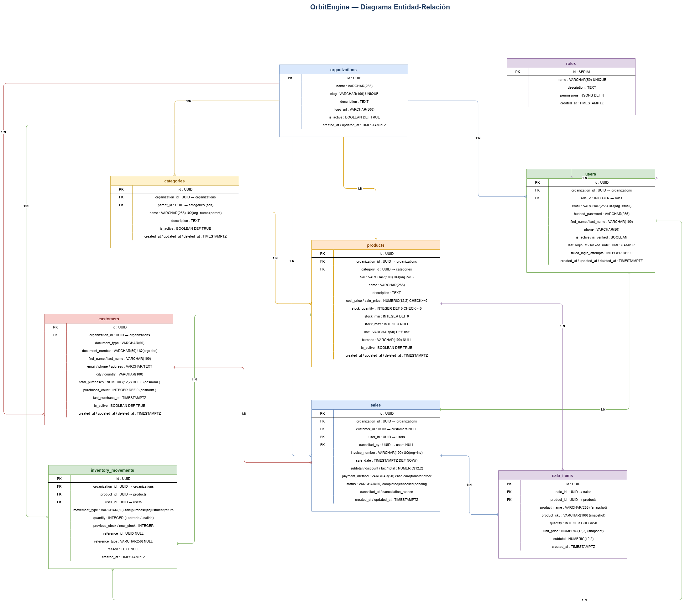

# Capítulo 3 — Análisis y Diseño del Sistema

---

## 3.1 Proceso de Levantamiento de Requisitos

### 3.1.1 Metodología de Levantamiento

El levantamiento de requisitos para OrbitEngine se realizó mediante un proceso iterativo que combinó tres técnicas complementarias:

1. **Entrevistas con usuarios potenciales**: se realizaron sesiones con propietarios y empleados de pymes del sector comercio para identificar sus procesos actuales, puntos de dolor y expectativas sobre una herramienta de gestión.
2. **Análisis de soluciones existentes**: se evaluaron las soluciones descritas en el estado del arte para identificar brechas funcionales.
3. **Elaboración de personas y escenarios**: se construyeron perfiles de usuario (personas) representativos de los distintos roles del sistema, que sirvieron de guía para la priorización de historias de usuario.

### 3.1.2 Perfiles de Usuario

OrbitEngine contempla tres perfiles de usuario, formalizados como roles dentro del modelo de control de acceso basado en roles (RBAC) del sistema. Cada perfil se describe mediante cuatro dimensiones: rol dentro del negocio, responsabilidades funcionales, permisos y alcance en el sistema, y necesidades de información; que sustentan tanto las decisiones de diseño de la interfaz como las restricciones implementadas a nivel de los endpoints de la API.

**Perfil 1 — Administrador**

- _Rol dentro del negocio_: responsable estratégico y operativo de la organización; típicamente corresponde al propietario o gerente de la pyme. Es quien rinde cuentas sobre los resultados del negocio y toma decisiones de abastecimiento, precios y gestión del personal.
- _Responsabilidades funcionales_: configurar la organización y sus parámetros, administrar el catálogo de productos y categorías, gestionar la base de clientes, supervisar el inventario, registrar y revisar ventas, y dar de alta o de baja a otros usuarios asignándoles roles.
- _Permisos y alcance en el sistema_: acceso completo (lectura, creación, modificación y eliminación) sobre todos los recursos pertenecientes a su organización, incluyendo la gestión de usuarios y la asignación de roles. No tiene acceso a recursos de otras organizaciones, en virtud del aislamiento multi-tenant.
- _Necesidades de información_: indicadores agregados en tiempo real (ventas del día y del mes, productos con stock bajo, top de productos y tendencia de ventas) y reportes exportables que sirvan como insumo para análisis externo o para la rendición de cuentas contable.

**Perfil 2 — Vendedor**

- _Rol dentro del negocio_: operador de punto de venta y de atención al cliente; ejecuta la operación cotidiana del negocio en términos de transacciones e interacción con compradores.
- _Responsabilidades funcionales_: registrar ventas multi-producto, consultar la disponibilidad de stock al momento de atender al cliente, asociar la venta a un cliente registrado y consultar el historial de compras del mismo para ofrecer un servicio personalizado.
- _Permisos y alcance en el sistema_: lectura sobre productos, categorías y clientes; creación de ventas y de los movimientos de inventario derivados de éstas; lectura de su propio historial de ventas. No puede modificar el catálogo, eliminar registros ni administrar usuarios.
- _Necesidades de información_: respuesta inmediata en consultas de catálogo y stock, flujo de registro de ventas optimizado para el menor número posible de pasos, y acceso rápido al historial reciente de un cliente durante la atención.

**Perfil 3 — Visualizador**

- _Rol dentro del negocio_: analista o asesor —frecuentemente externo, como un contador o consultor— que requiere visibilidad sobre la operación sin intervenir directamente en ella. Su valor agregado reside en la interpretación de los datos del negocio.
- _Responsabilidades funcionales_: revisar indicadores de desempeño, auditar registros de ventas y movimientos de inventario, y exportar listados operativos para su análisis posterior en herramientas externas.
- _Permisos y alcance en el sistema_: acceso de solo lectura sobre todos los recursos de la organización, incluida la capacidad de exportar a Excel los listados de inventario, ventas y clientes. No puede crear, modificar ni eliminar información, lo cual preserva la integridad de los datos cuando el perfil es ejercido por un tercero externo a la empresa.
- _Necesidades de información_: datos consolidados, consistentes y exportables, así como acceso a series históricas que permitan el análisis de tendencias y la elaboración de reportes contables o gerenciales.

### 3.1.3 Historias de Usuario Principales

A continuación se presentan las historias de usuario más representativas por módulo. El conjunto completo se encuentra en el documento de requisitos adjunto como anexo.

**Módulo de Autenticación:**

- HU-001: Como administrador, quiero registrar mi empresa en la plataforma para comenzar a gestionar mis operaciones.
- HU-002: Como usuario, quiero iniciar sesión con mi correo y contraseña para acceder a mis datos de manera segura.
- HU-003: Como administrador, quiero crear usuarios con diferentes roles para controlar qué puede hacer cada empleado.

**Módulo de Inventario:**

- HU-010: Como administrador, quiero agregar productos con precio, stock y categoría para tener un catálogo organizado.
- HU-011: Como administrador, quiero recibir alertas cuando el stock de un producto sea inferior al mínimo configurado.
- HU-012: Como vendedor, quiero consultar el stock disponible de un producto antes de registrar una venta.
- HU-013: Como administrador, quiero ver el historial de movimientos de un producto para entender cómo ha variado su stock.

**Módulo de Ventas:**

- HU-020: Como vendedor, quiero registrar una venta seleccionando múltiples productos para generar la factura automáticamente.
- HU-021: Como vendedor, quiero buscar un cliente por nombre o cédula para asociarlo a la venta.
- HU-022: Como administrador, quiero ver el historial de ventas filtrado por fecha y vendedor para hacer seguimiento a la gestión.

**Módulo de Clientes:**

- HU-030: Como administrador, quiero registrar un cliente con su información de contacto para crear una base de datos de compradores.
- HU-031: Como administrador, quiero ver el historial de compras de un cliente para entender su comportamiento.

**Módulo de Reportes:**

- HU-040: Como administrador, quiero ver un dashboard con los KPIs del negocio en tiempo real para tomar decisiones informadas.
- HU-041: Como contador o administrador, quiero exportar a Excel los listados de ventas, inventario o clientes (con los filtros aplicados) para procesarlos en herramientas externas.

## 3.2 Requisitos del Sistema

### 3.2.1 Requisitos Funcionales

Los requisitos funcionales se organizan por módulo. Cada requisito está identificado con un código único, su prioridad y criterios de aceptación.

#### RF-AUTH — Módulo de Autenticación y Usuarios

+--------------------------+------------------------------------------------------------------------------------------------------------------------------------------------------------+-----------------+
| ID                       | Requisito                                                                                                                                                  | Prioridad       |
+==========================+============================================================================================================================================================+=================+
| RF-AUTH-01               | El sistema debe permitir el registro de una nueva organización con nombre, email del administrador y contraseña.                                           | Alta            |
+--------------------------+------------------------------------------------------------------------------------------------------------------------------------------------------------+-----------------+
| RF-AUTH-02               | El sistema debe autenticar usuarios mediante email y contraseña, generando un token JWT con tiempo de expiración configurable.                             | Alta            |
+--------------------------+------------------------------------------------------------------------------------------------------------------------------------------------------------+-----------------+
| RF-AUTH-03               | El token JWT debe incluir el `user_id`, `organization_id` y `role` para que el backend pueda filtrar datos y verificar permisos sin consultas adicionales. | Alta            |
+--------------------------+------------------------------------------------------------------------------------------------------------------------------------------------------------+-----------------+
| RF-AUTH-04               | El sistema debe implementar control de acceso basado en roles: Administrador, Vendedor y Visualizador.                                                     | Alta            |
+--------------------------+------------------------------------------------------------------------------------------------------------------------------------------------------------+-----------------+
| RF-AUTH-05               | El sistema debe bloquear temporalmente una cuenta tras 5 intentos de inicio de sesión fallidos consecutivos.                                               | Media           |
+--------------------------+------------------------------------------------------------------------------------------------------------------------------------------------------------+-----------------+
| RF-AUTH-06               | El sistema debe permitir la recuperación de contraseña mediante un enlace enviado al email del usuario.                                                    | Media           |
+--------------------------+------------------------------------------------------------------------------------------------------------------------------------------------------------+-----------------+

#### RF-INV — Módulo de Gestión de Inventario

+--------------------------+-------------------------------------------------------------------------------------------------------------------------------------------------------------------------------------------------------+---------------------+
| ID                       | Requisito                                                                                                                                                                                             | Prioridad           |
+==========================+=======================================================================================================================================================================================================+=====================+
| RF-INV-01                | El sistema debe permitir crear, editar, desactivar y consultar productos con los campos: nombre, SKU, categoría, precio de costo, precio de venta, stock actual, stock mínimo, stock máximo e imagen. | Alta                |
+--------------------------+-------------------------------------------------------------------------------------------------------------------------------------------------------------------------------------------------------+---------------------+
| RF-INV-02                | El sistema debe descontar automáticamente el stock de los productos al registrar una venta.                                                                                                           | Alta                |
+--------------------------+-------------------------------------------------------------------------------------------------------------------------------------------------------------------------------------------------------+---------------------+
| RF-INV-03                | El sistema debe generar una alerta visible en el dashboard cuando el stock de un producto sea igual o inferior al stock mínimo configurado.                                                           | Alta                |
+--------------------------+-------------------------------------------------------------------------------------------------------------------------------------------------------------------------------------------------------+---------------------+
| RF-INV-04                | El sistema debe registrar cada movimiento de stock (ventas, ajustes manuales, carga inicial) con fecha, cantidad, tipo de movimiento y usuario responsable.                                           | Alta                |
+--------------------------+-------------------------------------------------------------------------------------------------------------------------------------------------------------------------------------------------------+---------------------+
| RF-INV-05                | El sistema debe permitir ajustes manuales de inventario con campo de justificación obligatorio.                                                                                                       | Media               |
+--------------------------+-------------------------------------------------------------------------------------------------------------------------------------------------------------------------------------------------------+---------------------+
| RF-INV-06                | El sistema debe permitir organizar los productos en categorías definidas por la organización.                                                                                                         | Media               |
+--------------------------+-------------------------------------------------------------------------------------------------------------------------------------------------------------------------------------------------------+---------------------+

#### RF-SAL — Módulo de Gestión de Ventas

+--------------------------+-------------------------------------------------------------------------------------------------------------------------------------+-----------------+
| ID                       | Requisito                                                                                                                           | Prioridad       |
+==========================+=====================================================================================================================================+=================+
| RF-SAL-01                | El sistema debe permitir registrar una venta seleccionando uno o más productos, con cantidad y precio unitario editable.            | Alta            |
+--------------------------+-------------------------------------------------------------------------------------------------------------------------------------+-----------------+
| RF-SAL-02                | El sistema debe calcular automáticamente el total de la venta, incluyendo descuentos si aplica.                                     | Alta            |
+--------------------------+-------------------------------------------------------------------------------------------------------------------------------------+-----------------+
| RF-SAL-03                | El sistema debe generar un número de factura único y secuencial por organización.                                                   | Alta            |
+--------------------------+-------------------------------------------------------------------------------------------------------------------------------------+-----------------+
| RF-SAL-04                | El sistema debe permitir asociar una venta a un cliente registrado.                                                                 | Media           |
+--------------------------+-------------------------------------------------------------------------------------------------------------------------------------+-----------------+
| RF-SAL-05                | El sistema debe registrar el método de pago (efectivo, tarjeta, transferencia).                                                     | Media           |
+--------------------------+-------------------------------------------------------------------------------------------------------------------------------------+-----------------+
| RF-SAL-06                | Solo el rol Administrador puede cancelar una venta registrada. La cancelación debe revertir el stock de los productos involucrados. | Alta            |
+--------------------------+-------------------------------------------------------------------------------------------------------------------------------------+-----------------+
| RF-SAL-07                | El historial de ventas debe ser filtrable por rango de fechas, cliente, vendedor y método de pago.                                  | Alta            |
+--------------------------+-------------------------------------------------------------------------------------------------------------------------------------+-----------------+

#### RF-CUS — Módulo de Gestión de Clientes

+--------------------------+-------------------------------------------------------------------------------------------------------------------+---------------+
| ID                       | Requisito                                                                                                         | Prioridad     |
+==========================+===================================================================================================================+===============+
| RF-CUS-01                | El sistema debe permitir registrar clientes con: nombre, email, teléfono y documento de identidad.                | Alta          |
+--------------------------+-------------------------------------------------------------------------------------------------------------------+---------------+
| RF-CUS-02                | El sistema debe mostrar el historial de compras de cada cliente con totales y fechas.                             | Alta          |
+--------------------------+-------------------------------------------------------------------------------------------------------------------+---------------+
| RF-CUS-03                | El sistema debe calcular y mostrar métricas por cliente: total comprado, número de compras, frecuencia de compra. | Media         |
+--------------------------+-------------------------------------------------------------------------------------------------------------------+---------------+

#### RF-REP — Módulo de Reportes y Dashboard

+--------------------------+----------------------------------------------------------------------------------------------------------------------------------------+-----------------+
| ID                       | Requisito                                                                                                                              | Prioridad       |
+==========================+========================================================================================================================================+=================+
| RF-REP-01                | El dashboard debe mostrar en tiempo real: ventas del día, ventas del mes, productos con stock bajo y top 5 productos más vendidos.     | Alta            |
+--------------------------+----------------------------------------------------------------------------------------------------------------------------------------+-----------------+
| RF-REP-02                | El dashboard debe incluir un gráfico de línea de ventas de los últimos 7 días.                                                         | Alta            |
+--------------------------+----------------------------------------------------------------------------------------------------------------------------------------+-----------------+
| RF-REP-03                | El sistema debe generar reportes de ventas por período (diario, semanal, mensual).                                                     | Alta            |
+--------------------------+----------------------------------------------------------------------------------------------------------------------------------------+-----------------+
| RF-REP-04                | El sistema debe permitir exportar a Excel (.xlsx) los listados filtrados de inventario, ventas y clientes desde el módulo de reportes. | Media           |
+--------------------------+----------------------------------------------------------------------------------------------------------------------------------------+-----------------+
| RF-REP-05                | El sistema debe generar un reporte de estado de inventario con productos agrupados por categoría.                                      | Media           |
+--------------------------+----------------------------------------------------------------------------------------------------------------------------------------+-----------------+

### 3.2.2 Requisitos No Funcionales

+--------------------------+------------------------------+-------------------------------------------------------------------------------------------------------------------------------------------------------------+
| ID                       | Categoría                    | Requisito                                                                                                                                                   |
+==========================+==============================+=============================================================================================================================================================+
| RNF-01                   | Rendimiento                  | El 95% de las respuestas de la API deben completarse en menos de 500ms bajo carga normal (hasta 50 usuarios concurrentes).                                  |
+--------------------------+------------------------------+-------------------------------------------------------------------------------------------------------------------------------------------------------------+
| RNF-02                   | Disponibilidad               | El sistema debe garantizar una disponibilidad mínima del 95% mensual.                                                                                       |
+--------------------------+------------------------------+-------------------------------------------------------------------------------------------------------------------------------------------------------------+
| RNF-03                   | Seguridad                    | Las contraseñas deben almacenarse con hash bcrypt (factor de coste ≥ 12).                                                                                   |
+--------------------------+------------------------------+-------------------------------------------------------------------------------------------------------------------------------------------------------------+
| RNF-04                   | Seguridad                    | La comunicación entre cliente y servidor debe realizarse exclusivamente mediante HTTPS (TLS 1.2+).                                                          |
+--------------------------+------------------------------+-------------------------------------------------------------------------------------------------------------------------------------------------------------+
| RNF-05                   | Seguridad                    | Todos los endpoints deben validar que el usuario autenticado pertenezca a la organización dueña del recurso solicitado.                                     |
+--------------------------+------------------------------+-------------------------------------------------------------------------------------------------------------------------------------------------------------+
| RNF-06                   | Usabilidad                   | La interfaz debe permitir completar el flujo de registro de una venta en menos de 5 pasos y menos de 60 segundos para un vendedor entrenado.                |
+--------------------------+------------------------------+-------------------------------------------------------------------------------------------------------------------------------------------------------------+
| RNF-07                   | Usabilidad                   | La interfaz debe ser responsive y funcional en dispositivos de 375px de ancho mínimo.                                                                       |
+--------------------------+------------------------------+-------------------------------------------------------------------------------------------------------------------------------------------------------------+
| RNF-08                   | Mantenibilidad               | La cobertura de pruebas automatizadas del backend debe ser mínimo del 60%.                                                                                  |
+--------------------------+------------------------------+-------------------------------------------------------------------------------------------------------------------------------------------------------------+
| RNF-09                   | Escalabilidad                | La arquitectura debe soportar el incremento de tenants sin cambios estructurales, mediante escalado horizontal de los componentes de la capa de aplicación. |
+--------------------------+------------------------------+-------------------------------------------------------------------------------------------------------------------------------------------------------------+

## 3.3 Arquitectura del Sistema

### 3.3.1 Decisiones Arquitectónicas

Las principales decisiones de diseño arquitectónico del sistema se tomaron considerando las restricciones del proyecto (equipo de 3 personas, plazo de 7 meses, presupuesto acotado) y los requisitos no funcionales de escalabilidad, seguridad y mantenibilidad.

+---------------------------------------+------------------------------------+--------------------------------------------------------------------------------------------------------------------------------------------------------------+
| Decisión                              | Alternativa considerada            | Justificación                                                                                                                                                |
+=======================================+====================================+==============================================================================================================================================================+
| SPA (React)                           | Server-side rendering (Next.js)    | Mayor interactividad sin recargas; la naturaleza de la aplicación (dashboard, tablas, formularios) se beneficia de la reactividad de un SPA.                 |
+---------------------------------------+------------------------------------+--------------------------------------------------------------------------------------------------------------------------------------------------------------+
| REST API                              | GraphQL                            | Menor curva de aprendizaje, amplio soporte de herramientas, adecuado para el número de entidades del sistema.                                                |
+---------------------------------------+------------------------------------+--------------------------------------------------------------------------------------------------------------------------------------------------------------+
| Multi-tenancy por campo discriminador | BD por tenant / esquema por tenant | Menor complejidad operativa y menor costo de infraestructura; adecuado para el número de tenants esperado en el MVP.                                         |
+---------------------------------------+------------------------------------+--------------------------------------------------------------------------------------------------------------------------------------------------------------+
| Monolito modular                      | Microservicios                     | Apropiado para el tamaño del equipo y la fase de desarrollo; la modularidad interna permite extraer servicios en el futuro.                                  |
+---------------------------------------+------------------------------------+--------------------------------------------------------------------------------------------------------------------------------------------------------------+
| PostgreSQL                            | MongoDB                            | Los datos del negocio (ventas, productos, clientes) son inherentemente relacionales; PostgreSQL ofrece garantías ACID necesarias para integridad financiera. |
+---------------------------------------+------------------------------------+--------------------------------------------------------------------------------------------------------------------------------------------------------------+
| JWT sin estado                        | Sesiones en servidor (Redis)       | Permite escalado horizontal sin sincronización de sesiones entre instancias del backend.                                                                     |
+---------------------------------------+------------------------------------+--------------------------------------------------------------------------------------------------------------------------------------------------------------+

### 3.3.2 Vista de Componentes de Alto Nivel

El sistema se organiza en tres componentes principales desplegados de forma independiente:

### 3.3.3 Arquitectura del Backend en Capas

El backend implementa una arquitectura de tres capas con clara separación de responsabilidades:

**Capa de API** (`app/api/`): recibe las solicitudes HTTP, valida los datos de entrada mediante los schemas de Pydantic, verifica la autenticación y autorización, y delega la lógica de negocio a la capa de servicios. Los endpoints siguen la convención REST estándar.

**Capa de Servicios** (`app/crud.py`): contiene la lógica de negocio del sistema. Aquí se encuentran las reglas del dominio: descuento de stock al registrar una venta, cálculo de totales, generación del número de factura, agregación de métricas para reportes. Esta capa es independiente del protocolo de transporte (HTTP), lo que facilita el testing unitario.

**Capa de Acceso a Datos** (SQLModel + SQLAlchemy): gestiona las interacciones con la base de datos mediante el ORM SQLModel. Todas las queries incluyen automáticamente el filtro por `organization_id` para garantizar el aislamiento multi-tenant.

### 3.3.4 Estrategia de Multi-Tenancy

La estrategia de multi-tenancy adoptada es la de **tabla compartida con discriminador de organización**. Cada tabla de datos de negocio contiene una columna `organization_id` (UUID, FK a la tabla `organizations`) que identifica a qué organización pertenece cada registro.

El aislamiento se refuerza en dos niveles:

1. **JWT**: al autenticarse, el `organization_id` del usuario queda incluido en el token. Cada solicitud al backend extrae este valor del token antes de ejecutar cualquier operación.
2. **Dependencia de base de datos**: la función `get_current_organization()` (inyectada como dependencia en todos los endpoints) verifica que el recurso solicitado pertenezca a la organización del usuario autenticado, levantando un error HTTP 403 si no coincide.

Este enfoque garantiza que, incluso si un token JWT es comprometido, el atacante solo puede acceder a los datos de la organización asociada a ese token.

### 3.3.5 Flujos Principales del Sistema

A continuación se describen, en términos funcionales, los dos flujos transversales más representativos del sistema. Estos flujos articulan las responsabilidades del cliente, del backend y de la base de datos, y permiten ilustrar la interacción entre los componentes presentados en las secciones anteriores.

**Flujo de autenticación.** El proceso se inicia cuando el usuario suministra sus credenciales —correo electrónico y contraseña— en la interfaz del cliente. El cliente envía estas credenciales al endpoint de autenticación del backend mediante una solicitud cifrada por TLS. El backend localiza al usuario en la base de datos, verifica la contraseña contra el hash almacenado y, en caso de éxito, emite un JSON Web Token firmado que incorpora como claims el identificador del usuario, el identificador de la organización a la que pertenece, su rol asignado y la marca de expiración. El cliente recibe el token, lo conserva en una capa de estado en memoria del navegador y lo incluye en la cabecera _Authorization_ de todas las solicitudes posteriores, lo cual permite al backend autorizar cada operación sin necesidad de mantener sesiones en servidor.

**Flujo de registro de una venta.** El usuario con rol de vendedor selecciona los productos a facturar, sus cantidades y, opcionalmente, el cliente asociado a la transacción. Al confirmar la operación, el cliente envía la información al backend, que ejecuta la lógica de negocio dentro de una transacción atómica para garantizar la consistencia: en primer lugar, verifica que exista stock suficiente para cada uno de los productos solicitados; a continuación, calcula los totales aplicando los descuentos y demás reglas comerciales pertinentes; luego, genera un número de factura secuencial dentro del ámbito de la organización. Acto seguido, persiste el registro de la venta junto con sus ítems detallados, descuenta el stock de cada producto y registra los movimientos de inventario correspondientes para conservar la trazabilidad. Finalmente, evalúa si algún producto ha quedado por debajo de su nivel mínimo configurado y, de ser así, dispara la alerta correspondiente. La operación concluye con la confirmación al cliente, que muestra al usuario el número de factura asignado y la información resumida de la transacción.

## 3.4 Diseño del Modelo de Datos

### 3.4.1 Entidades Principales

El modelo de datos se organiza alrededor de las siguientes entidades:

- **organizations**: representa cada empresa cliente de la plataforma (tenant). Es la raíz de la jerarquía de datos.
- **users**: usuarios del sistema asociados a una organización y un rol.
- **categories**: categorías de productos, definidas por organización.
- **products**: catálogo de productos con control de stock.
- **customers**: base de datos de clientes de la organización.
- **sales**: registros de transacciones de venta.
- **sale_items**: ítems individuales de cada venta (relación N:M entre sales y products).
- **inventory_movements**: historial de todos los cambios en el stock de cada producto.
- **audit_logs**: registro inmutable de acciones críticas del sistema.

### 3.4.2 Diagrama Entidad-Relación

### 3.4.3 Tabla: `organizations`

+------------+-----------------------+---------------------------+
| Columna    | Tipo                  | Descripción               |
+============+=======================+===========================+
| id         | UUID PK               | Identificador único       |
+------------+-----------------------+---------------------------+
| name       | VARCHAR(255) NOT NULL | Nombre de la organización |
+------------+-----------------------+---------------------------+
| slug       | VARCHAR(100) UNIQUE   | Identificador en URL      |
+------------+-----------------------+---------------------------+
| is_active  | BOOLEAN DEFAULT TRUE  | Estado de la organización |
+------------+-----------------------+---------------------------+
| created_at | TIMESTAMP             | Fecha de registro         |
+------------+-----------------------+---------------------------+

### 3.4.4 Tabla: `users`

+-------------------------+--------------+---------------------------------+
| Columna                 | Tipo         | Descripción                     |
+=========================+==============+=================================+
| id                      | UUID PK      | Identificador único             |
+-------------------------+--------------+---------------------------------+
| organization_id         | UUID FK      | Organización a la que pertenece |
+-------------------------+--------------+---------------------------------+
| role                    | ENUM         | admin / seller / viewer         |
+-------------------------+--------------+---------------------------------+
| email                   | VARCHAR(255) | Email (único por organización)  |
+-------------------------+--------------+---------------------------------+
| hashed_password         | VARCHAR(255) | Hash bcrypt                     |
+-------------------------+--------------+---------------------------------+
| full_name               | VARCHAR(200) | Nombre completo                 |
+-------------------------+--------------+---------------------------------+
| is_active               | BOOLEAN      | Estado del usuario              |
+-------------------------+--------------+---------------------------------+
| created_at / updated_at | TIMESTAMP    | Auditoría                       |
+-------------------------+--------------+---------------------------------+

### 3.4.5 Tabla: `products`

+-----------------+---------------+------------------------------+
| Columna         | Tipo          | Descripción                  |
+=================+===============+==============================+
| id              | UUID PK       | Identificador único          |
+-----------------+---------------+------------------------------+
| organization_id | UUID FK       | Multi-tenancy                |
+-----------------+---------------+------------------------------+
| category_id     | UUID FK       | Categoría del producto       |
+-----------------+---------------+------------------------------+
| name            | VARCHAR(255)  | Nombre del producto          |
+-----------------+---------------+------------------------------+
| sku             | VARCHAR(100)  | SKU (único por organización) |
+-----------------+---------------+------------------------------+
| cost_price      | DECIMAL(12,2) | Precio de costo              |
+-----------------+---------------+------------------------------+
| sale_price      | DECIMAL(12,2) | Precio de venta              |
+-----------------+---------------+------------------------------+
| stock_quantity  | INTEGER       | Stock actual                 |
+-----------------+---------------+------------------------------+
| min_stock       | INTEGER       | Stock mínimo para alerta     |
+-----------------+---------------+------------------------------+
| max_stock       | INTEGER       | Stock máximo sugerido        |
+-----------------+---------------+------------------------------+
| is_active       | BOOLEAN       | Estado del producto          |
+-----------------+---------------+------------------------------+

### 3.4.6 Tabla: `sales`

+-----------------+---------------+-------------------------------+
| Columna         | Tipo          | Descripción                   |
+=================+===============+===============================+
| id              | UUID PK       | Identificador único           |
+-----------------+---------------+-------------------------------+
| organization_id | UUID FK       | Multi-tenancy                 |
+-----------------+---------------+-------------------------------+
| invoice_number  | VARCHAR(50)   | Número único de factura       |
+-----------------+---------------+-------------------------------+
| customer_id     | UUID FK NULL  | Cliente asociado (opcional)   |
+-----------------+---------------+-------------------------------+
| seller_id       | UUID FK       | Usuario que registró la venta |
+-----------------+---------------+-------------------------------+
| total_amount    | DECIMAL(12,2) | Total de la venta             |
+-----------------+---------------+-------------------------------+
| discount_amount | DECIMAL(12,2) | Descuento aplicado            |
+-----------------+---------------+-------------------------------+
| payment_method  | ENUM          | cash / card / transfer        |
+-----------------+---------------+-------------------------------+
| status          | ENUM          | completed / cancelled         |
+-----------------+---------------+-------------------------------+
| created_at      | TIMESTAMP     | Fecha de la venta             |
+-----------------+---------------+-------------------------------+

### 3.4.7 Estrategia de Índices

Los índices se definieron considerando los patrones de consulta más frecuentes:

- `idx_products_organization_id`: acelera la recuperación del catálogo de productos de una organización.
- `idx_sales_organization_created_at`: soporta las consultas de ventas por período en el módulo de reportes.
- `idx_sale_items_product_id`: acelera la agregación de ventas por producto en los reportes de productos más vendidos.
- `idx_users_organization_email` (UNIQUE): garantiza unicidad de email dentro de la organización y acelera el login.

### 3.4.8 Estrategia de Soft Delete

Las entidades principales (usuarios, productos, clientes) implementan soft delete mediante un campo `deleted_at TIMESTAMP NULL`. Un registro se considera activo cuando `deleted_at IS NULL`. Los índices únicos incluyen la cláusula `WHERE deleted_at IS NULL` para permitir la reutilización de valores únicos (como email o SKU) tras la eliminación lógica.

## 3.5 Diseño de la Interfaz de Usuario

### 3.5.1 Principios de Diseño

El diseño de la interfaz de OrbitEngine se guió por los siguientes principios:

1. **Mínima curva de aprendizaje**: usuarios con conocimientos tecnológicos básicos deben poder completar las tareas principales sin capacitación extensa.
2. **Máximo 3 clics**: cualquier funcionalidad del sistema debe ser accesible desde el punto de entrada actual en no más de tres interacciones.
3. **Feedback inmediato**: cada acción del usuario (guardar, eliminar, registrar una venta) produce una respuesta visual clara (notificaciones toast, estados de carga, confirmaciones).
4. **Consistencia visual**: todos los módulos comparten el mismo sistema de componentes (shadcn/ui), garantizando coherencia en botones, formularios, tablas y modales.

### 3.5.2 Estructura de Navegación

La aplicación utiliza un layout de sidebar fijo con las siguientes secciones de navegación principal:

- **Dashboard**: vista resumen con KPIs y alertas.
- **Inventario**: gestión de productos y categorías, historial de movimientos.
- **Ventas**: registro de nuevas ventas e historial.
- **Clientes**: base de datos y perfiles de clientes.
- **Reportes**: exportación a Excel de los listados de inventario, ventas y clientes con filtros aplicados.
- **Configuración**: gestión de usuarios y perfil de la organización (solo Administrador).

### 3.5.3 Sistema de Diseño

La interfaz fue construida sobre **shadcn/ui**, una colección de componentes accesibles (WAI-ARIA compliant) construidos sobre Radix UI y estilizados con Tailwind CSS. La elección de este sistema de diseño garantiza:

- Accesibilidad estándar sin esfuerzo adicional.
- Consistencia visual entre todos los módulos.
- Facilidad de personalización mediante variables CSS de Tailwind.
- Componentes responsivos por defecto.
